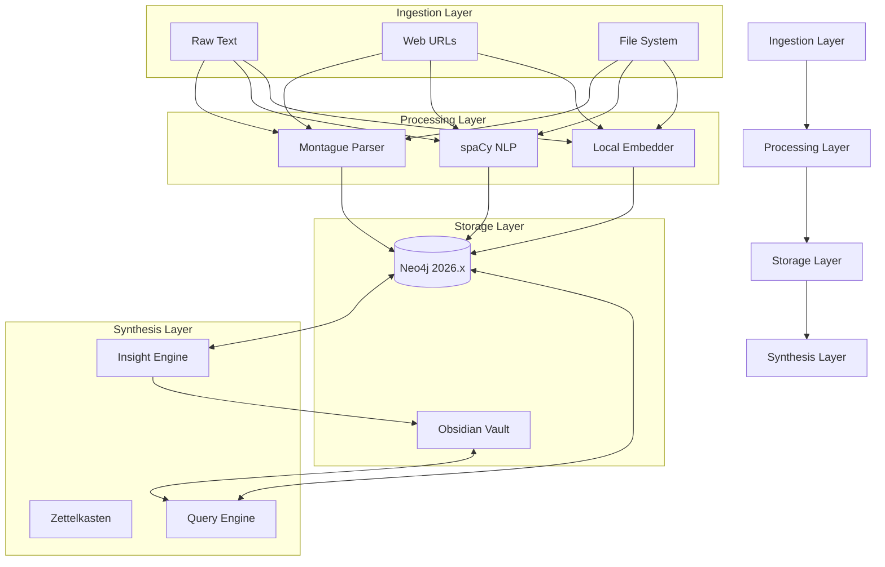

# Project Synapse Architecture

Project Synapse is an autonomous knowledge synthesis engine and Model Context Protocol (MCP) server. It bridges the gap between raw information ingestion and structured, permanent knowledge storage by combining semantic parsing, a hybrid Neo4j knowledge graph, and a Zettelkasten-style Obsidian wiki.

## 1. High-Level System Overview

The system operates as a continuous synthesis pipeline, moving information through four distinct layers:

## 2. Core Components

### 2.1. Knowledge Graph (Neo4j)
The backbone of Synapse's memory. It uses Neo4j 2026.x features to provide:
- **Native Vector Storage**: Stores high-dimensional embeddings directly on nodes.
- **Hybrid Search**: Combines BM25 keyword search, ANN vector search, and graph traversal.
- **Schema**:
    - `Entity`: Named entities extracted from text.
    - `Fact`: Atomic semantic statements.
    - `Zettel`: Synthesized insights and patterns.
    - `RELATES`: Semantic relationships between entities.
    - `MENTIONS`: Links between facts and entities.
    - `SUPPORTED_BY`: Links between insights and their evidence.

### 2.2. Semantic Integrator
A pipeline that transforms raw text into structured graph data.
- **Parsing**: Uses Montague Grammar for formal semantic representation.
- **Entity Resolution**: Identifies and links entities across different text sources.
- **Embedding**: Generates vectors locally using `sentence-transformers` or `Ollama`.

### 2.3. Wiki Adapter
The bridge to a physical Zettelkasten (Obsidian vault).
- **Frontmatter Management**: Synchronizes graph metadata with Markdown files.
- **Index Generation**: Automatically builds and maintains a `SUMMARY.md` and topic clusters.
- **Vault Integrity**: Performs health checks to detect orphaned pages or broken links.

### 2.4. Insight Engine
The autonomous synthesis layer.
- **Pattern Recognition**: Scans the graph for isomorphisms and repeating structures.
- **Zettel Generation**: Produces novel insights (Zettels) backed by evidence trails.
- **Clustering**: Groups related knowledge into semantic islands.

## 3. Data Flow: The Ingestion Pipeline

1. **Extraction**: Text is ingested via tools like `wiki_fetch_url` or `ingest_text`.
2. **Analysis**: The `MontagueParser` generates logical forms, while spaCy extracts entities.
3. **Graph Storage**: Data is MERGED into Neo4j. If a node exists, it is updated with new confidence scores and source markers.
4. **Vectorization**: Content is embedded and stored in the Neo4j vector index.
5. **Synthesis**: The `InsightEngine` triggers a scan for connections. If an insight threshold is met, a new Zettel is created in the Wiki.

## 4. Design Philosophy

- **Local-First**: No dependence on external paid LLM APIs for core indexing or search. Everything runs locally (Neo4j, spaCy, sentence-transformers).
- **Semantic Precision**: Prioritizes formal logical structures (Montague Grammar) over simple keyword matching.
- **Auditability**: Every synthesized insight maintains a strict "evidence trail" (`SUPPORTED_BY`) back to the raw source data.
- **Interoperability**: Exposes all capabilities through the standard Model Context Protocol, making it accessible to any AI agent.
